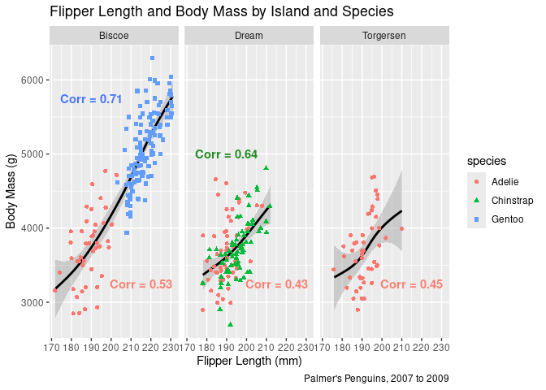
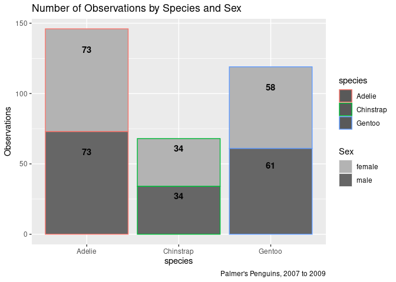
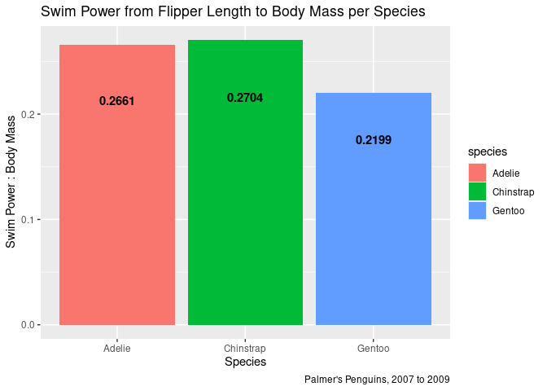

Penguins Sample R Document
================
Jared White
2024-03-12

© Jared White, 2024. This work is licensed under a [Creative Commons
Attribution 4.0 International
License](https://creativecommons.org/licenses/by/4.0/).

## A Short Analysis of the Palmer’s Penguins Dataset R Library

#### Load Libraries & Dataset

The Palmer Penguins data is one of the many standard datasets that is
available within CRAN, and is commonly used to demonstrate the
capabilities of analysis and visualization with the R TidyVerse package.

``` r
library(tidyverse)
library(janitor)
library(palmerpenguins)
pallete1 <- c("royalblue1", "forestgreen", "salmon")
pallete2 <-  c("#b69574", "#efe0bf")
scale_color_manual(values = pallete1)
```

    ## <ggproto object: Class ScaleDiscrete, Scale, gg>
    ##     aesthetics: colour
    ##     axis_order: function
    ##     break_info: function
    ##     break_positions: function
    ##     breaks: waiver
    ##     call: call
    ##     clone: function
    ##     dimension: function
    ##     drop: TRUE
    ##     expand: waiver
    ##     get_breaks: function
    ##     get_breaks_minor: function
    ##     get_labels: function
    ##     get_limits: function
    ##     get_transformation: function
    ##     guide: legend
    ##     is_discrete: function
    ##     is_empty: function
    ##     labels: waiver
    ##     limits: NULL
    ##     make_sec_title: function
    ##     make_title: function
    ##     map: function
    ##     map_df: function
    ##     n.breaks.cache: NULL
    ##     na.translate: TRUE
    ##     na.value: grey50
    ##     name: waiver
    ##     palette: function
    ##     palette.cache: NULL
    ##     position: left
    ##     range: environment
    ##     rescale: function
    ##     reset: function
    ##     train: function
    ##     train_df: function
    ##     transform: function
    ##     transform_df: function
    ##     super:  <ggproto object: Class ScaleDiscrete, Scale, gg>

``` r
# the data is already very clean, but does have 11 NAs, which are dropped.
df <- penguins %>% clean_names() %>% drop_na()
```

#### Creating Some Useful Variables and Exploratory Statistics.

###### First and Last Years of the Data.

``` r
fyr <- min(penguins$year)
lyr <- max(penguins$year)
```

###### Correlation between body mass and flipper length per island and species.

``` r
bm_fl_cor <- df %>% group_by(island, species) %>% summarise(correlation = cor(body_mass_g, flipper_length_mm), avg_bm = mean(body_mass_g), avg_fl = mean(flipper_length_mm))
head(bm_fl_cor)
```

    ## # A tibble: 5 × 5
    ## # Groups:   island [3]
    ##   island    species   correlation avg_bm avg_fl
    ##   <fct>     <fct>           <dbl>  <dbl>  <dbl>
    ## 1 Biscoe    Adelie          0.526  3710.   189.
    ## 2 Biscoe    Gentoo          0.711  5092.   217.
    ## 3 Dream     Adelie          0.433  3701.   190.
    ## 4 Dream     Chinstrap       0.642  3733.   196.
    ## 5 Torgersen Adelie          0.459  3709.   192.

``` r
# standard deviations of summary values
sd_bm_fl_cor <- sd(bm_fl_cor$correlation)
sd_avg_bm <- sd(bm_fl_cor$avg_bm)
sd_avg_fl <- sd(bm_fl_cor$avg_fl)
```

#### The Classic Body Mass to Flipper Length Visualization, with Some Extra Flare

This is one of the most widely created correlation visuals in R. It
shows a positive correlation between the total body mass of penguins in
grams and the length of their flippers in millimeters. This sppecific
series of scatterplots also identifies the difference between the three
species’ size and native islands.

``` r
# need to create dfs for custom annotations per species...
plot1_ann_gent <- data.frame(island = c("Biscoe"), label = c("Corr = 0.71"))
plot1_ann_chin <- data.frame(island = c("Dream"), label = c("Corr = 0.64"))
plot1_ann_adel <- data.frame(island = c("Biscoe", "Dream", "Torgersen"), label = c("Corr = 0.53", "Corr = 0.43", "Corr = 0.45"))

ggplot(data = df)+
  # Gam Smoothing is used
  geom_smooth(mapping = aes(x=flipper_length_mm, y=body_mass_g), color = 'black', method = "gam" )+
  # Jitter and color+shape is used to help with overplotting
  geom_jitter(aes(x=flipper_length_mm, y=body_mass_g,
                  color = species, shape = species)) +
  # Separate the plots by native island.
  facet_wrap(~ island) +
  # Adding the custom annotation values and labels
  geom_text(x = 190, y = 5750, aes(label = label), data = plot1_ann_gent, color = 'royalblue1', fontface = "bold") +
  geom_text(x = 190, y = 5000, aes(label = label), data = plot1_ann_chin, color = 'forestgreen', fontface = "bold") +
  geom_text(x = 215, y = 3250, aes(label = label), data = plot1_ann_adel, color = 'salmon', fontface = "bold") +
  labs(title = "Flipper Length and Body Mass by Island and Species", x = "Flipper Length (mm)", y = "Body Mass (g)", caption = paste0("Palmer's Penguins, ", fyr, " to ", lyr))
```

<!-- -->

As these plots illustrate, Adelie penguins inhabit all three islands,
whereas Gentoos and Chinstraps occupy only one island each - Biscoe and
Dream respectively. Notably, although Adelies exhibit the lowest
correlation between body mass and flipper length overall, the
correlation within this species is noticeably higher on the island that
is shared with the species having the highest correlation (Biscoe, which
is also inhabited by Gentoo penguins). This raises interesting questions
about environmental adaptation and possible cross-breeding which could
be the subject of future research. While cross-breeding between penguin
species is relatively rare, there have been recently observed and
documented cases of this occurring.

Sources: [Nature.com, Feb 13,
2024](https://www.nature.com/articles/s41598-024-54105-w),
[BouldersBeachPenguins.com](https://bouldersbeachpenguins.com/can-penguins-crossbreed/)

#### Visualization of the Number of Observations by Sex and Species

``` r
sp_sex_summary <- df %>% group_by(species, sex) %>% summarise(count = n())

ggplot(data = sp_sex_summary) + geom_col(mapping = aes(x = species, y = count, fill = sex, color = species)) +
  scale_fill_grey(start = 0.7, end = 0.4) +
    geom_text(aes(label = count, x = species, y = ifelse(sex =="male", count-(.2*count), count+(.8*count))), color = "black", fontface = "bold") +
  labs(title = "Number of Observations by Species and Sex", caption = paste0("Palmer's Penguins, ", fyr, " to ", lyr), y = "Observations", fill = "Sex")
```

<!-- -->

The representation of male and female Gentoos differs slightly, likely
due to a slight sampling bias rather than reflecting the true
composition of the entire population.

#### Using the Dataset to Predict the Fastest-Swimming Species

#### (and Why its not what this dataset might suggest)

According to [This Research
Article](https://pubs.aip.org/aip/pof/article-abstract/35/6/061907/2897344/Hydrodynamic-performance-of-a-penguin-wing-Effect?redirectedFrom=fulltext)
on the hydrodynamic performance of penguin wings, published June of
2023: “Results indicate that feathering is the primary contributor to
thrust generation.” Feathering is the angling of the wings for optimal
hydrodynamic performance. Additionally, the publication states: “Spatial
analysis of the thrust shows that the outer three-fifths of the wing are
the primary source of thrust, contributing 85.4% of thrust generation at
optimal feathering amplitude.” Since the flipper width is not included
in the dataset, it is not possible to calculate the total wing area.
However, the cited publication does detail a full computer simulation of
penguin hydrodynamics. The following ratio is a *very* rough
approximation of this model given the data available:

$$
SP_{fl} : BodyMass = 10 \times \frac{fl \times .5124}{BodyMass}
$$

Since the outer 60% of the flipper generates 85.4% of the total thrust,
51.24% of the total flipper length is divided by the body mass. This
figure is then multiplied by 10 to create a rounded Swim Power from
flipper length : Body Mass ratio.

###### Adding the metric to a new df and summarizing.

``` r
df_sr <- df %>% mutate(sp_ratio = round(10*((flipper_length_mm*.5124)/body_mass_g), digits = 2))
df_sr_summary <- df_sr %>% group_by(species) %>% summarise(avg_sp_ratio = round(mean(sp_ratio), digits = 4))

ggplot(data = df_sr_summary) + geom_col(aes(x = species, y = avg_sp_ratio, fill = species)) +
  geom_text(aes(x = species, y = avg_sp_ratio-(.2*avg_sp_ratio), label = avg_sp_ratio, fontface = 'bold'), color = "black") +
  labs(title = "Swim Power from Flipper Length to Body Mass per Species", caption = paste0("Palmer's Penguins, ", fyr, " to ", lyr), y = "Swim Power : Body Mass", x = "Species")
```

<!-- -->

Despite having the lowest Swim Power from Flipper Length : Body Mass
Ratio, Gentoo penguins are the fastest average swimmers out of the three
species included in the dataset. This demonstrates the effectiveness of
optimal feathering on hydrodynamics. Additionally, the formula for this
ratio does not account for the size of the penguins’ air sacs or many
other relevant factors.

#### Citations

###### Core R

R Core Team (2023). *R: A Language and Environment for Statistical
Computing*. R Foundation for Statistical Computing, Vienna, Austria.
<https://www.R-project.org/>.

###### Tidyverse package

Wickham H, Averick M, Bryan J, Chang W, McGowan LD, François R,
Grolemund G, Hayes A, Henry L, Hester J, Kuhn M, Pedersen TL, Miller E,
Bache SM, Müller K, Ooms J, Robinson D, Seidel DP, Spinu V, Takahashi K,
Vaughan D, Wilke C, Woo K, Yutani H (2019). “Welcome to the tidyverse.”
*Journal of Open Source Software*, *4*(43), 1686. doi:
10.21105/joss.01686 (URL: <https://doi.org/10.21105/joss.01686>).

###### Janitor Package

Sam Firke (2023). janitor: Simple Tools for Examining and Cleaning Dirty
Data. R package version 2.2.0.
<https://CRAN.R-project.org/package=janitor>

###### Penguins Dataset

Horst AM, Hill AP, Gorman KB (2020). palmerpenguins: Palmer Archipelago
(Antarctica) penguin data. R package version 0.1.0.
<https://allisonhorst.github.io/palmerpenguins/>. doi:
10.5281/zenodo.3960218.

###### Penguin Species Cross-Breeding Articles

Borecki, P., Rosenberger, J., Mucha, A. et al. Breeding behavior
analysis in a large captive colony of African penguins (Spheniscus
demersus) and its implications for population management and
conservation. *Sci Rep* 14, 3589 (2024).
<https://doi.org/10.1038/s41598-024-54105-w>

<https://bouldersbeachpenguins.com/can-penguins-crossbreed/> © 2024
bouldersbeachpenguins.com - A project by Jan Pretorius

###### Gentoo Feathering Research

Zhanzhou Hao, Bo Yin, Prasert Prapamonthon, Guowei Yang; Hydrodynamic
performance of a penguin wing: Effect of feathering and flapping.
*Physics of Fluids* 1 June 2023; 35 (6): 061907.
<https://doi.org/10.1063/5.0147776>
